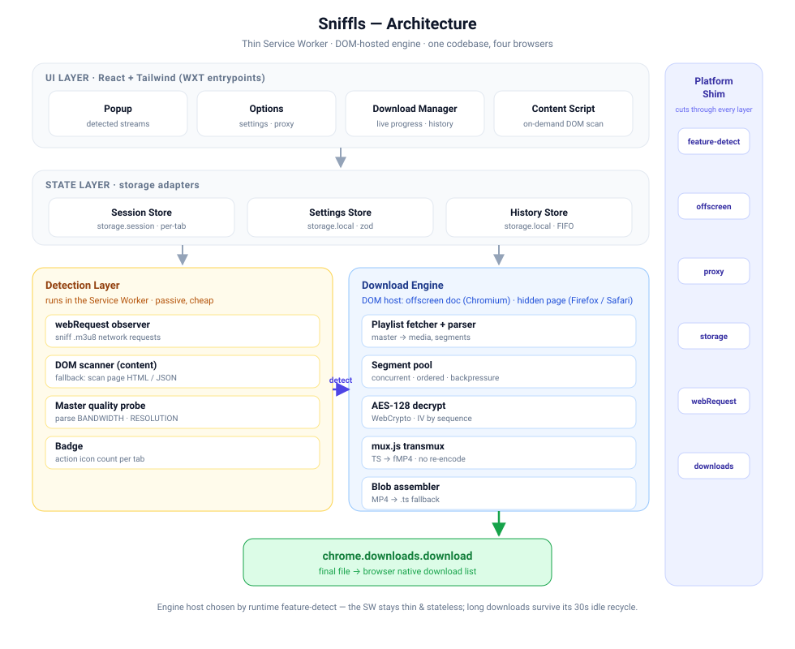
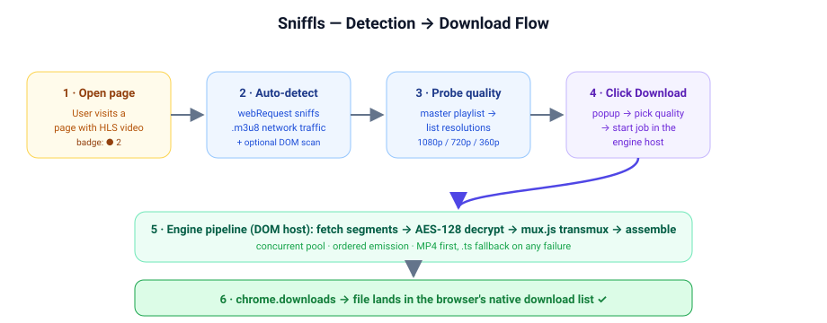
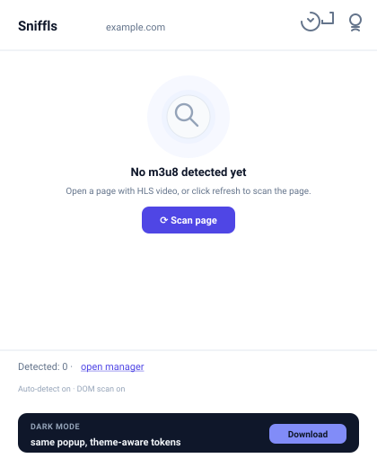
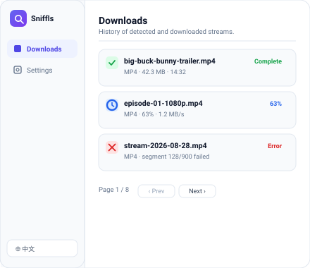
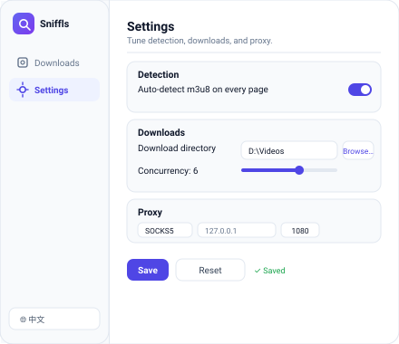

<p align="center">
  
</p>

<h1 align="center">Sniffls</h1>

<p align="center">
  🌐 <a href="./README.md">English</a> &nbsp;|&nbsp; 简体中文<br/>
  一款跨浏览器扩展，<b>自动检测 m3u8（HLS）流</b>并<b>下载为 MP4</b>——直接存入浏览器下载列表。无需桌面端、无需 ffmpeg、无需任何外部工具。
</p>

<p align="center">
  基于 <b>WXT + React + TypeScript + Tailwind</b> 构建。一套代码 → <b>Chrome / Edge / Firefox / Safari</b>（Manifest V3）。
</p>

<p align="center">
<!-- 将下方的 {repo} 替换为你的 GitHub 仓库地址，例如 https://github.com/user/sniff-hls -->
  <a href="{repo}/stargazers"></a>
  <a href="https://paypal.me/halo651891"></a>
  <a href="#-许可证"></a>
</p>

<p align="center">
  💖 觉得好用？在 GitHub 给个 ⭐，或<a href="https://paypal.me/halo651891">通过 PayPal 请作者喝杯咖啡</a>——每一杯都是项目持续维护的动力。☕
</p>

---

## ✨ 功能特性

- **自动检测**：通过 `webRequest` 网络嗅探 + 按需 DOM 扫描，识别任意页面的 m3u8——包括把真实播放列表藏在 `?url=` 查询参数里的包装页。
- **下载为 MP4**：经典 `.ts` HLS 用 `mux.js` 转封装为 fMP4（不重编码）。**CMAF/fMP4**（`#EXT-X-MAP`）拼接 init + 分片；分离音轨（`#EXT-X-MEDIA` + `AUDIO=`）用 [mediabunny](https://mediabunny.dev/) remux。经典 TS 在不支持的加密或异常编码时自动降级为 `.ts`。
- **X（Twitter）视频**：支持 `video.twimg.com` 的 amplify HLS（音视频分离的 CMAF），下载为带音频的单个可播 MP4。打开含视频的帖子，等角标出现后在弹窗下载（可选手动选清晰度）。若所在网络无法访问 CDN，请在设置里启用代理，或使用系统/浏览器代理。
- **AES-128 解密**：基于 WebCrypto（显式 IV 或按 RFC 8216 序号派生 IV）。
- **清晰度选择**：列出 master playlist 的所有档位；默认最高码率。
- **并发分片下载**：带重试 + 指数退避（可配 1–20）。
- **下载管理器**：实时进度、历史记录、重试、清空。
- **角标计数**：工具栏图标显示当前页检测到的流数量。
- **代理支持**：受限网络下可设置每扩展独立的代理。
- **跨浏览器**：Chrome、Edge、Firefox、Safari。
- **隐私优先**：遥测默认关闭；URL、页面标题、文件内容绝不离开浏览器。

---

## 🧠 工作原理



### 检测 → 下载流程



<details>
<summary>架构图的 ASCII 版本</summary>

```
┌──────────────────────────────────────────────────────────────┐
│  UI 层 (React + Tailwind, WXT entrypoints)                     │
│  popup · options · download-manager · content script           │
└───────────▲───────────────────────────────────┬──────────────┘
            │ runtime 消息                       │ storage
┌───────────┴───────────────────────────────────▼──────────────┐
│  状态层  (session · settings · history stores)               │
└───────────▲───────────────────────────────────┬──────────────┘
            │                                     │
┌───────────┴────────────┐           ┌────────────▼───────────────┐
│  检测层 (SW)             │           │  下载引擎 (DOM 宿主)         │
│  webRequest 观察器       │──检测到──▶│  playlist fetcher + parser  │
│  DOM 扫描器 (content)   │           │  分片并发池                  │
│  master 清晰度探测       │           │  AES-128 解密 (WebCrypto)   │
└─────────────────────────┘           │  mux.js 转封装 (TS→fMP4)     │
                                      │  blob 拼接 (+ts 兜底)        │
                                      └─────────────┬───────────────┘
                                                    │ blob URL
                                      ┌─────────────▼───────────────┐
                                      │  chrome.downloads.download   │
                                      └─────────────────────────────┘
        ┌──────────────────────────────────────────────────────────┐
        │  跨浏览器平台 shim（downloads / proxy / storage）           │
        └──────────────────────────────────────────────────────────┘
```

</details>

### 为什么这个架构性能更好
- **MV3 Service Worker 保持轻量。** 所有重活（分片池、解密、转封装、Blob 拼接，以及调用 `chrome.downloads`）跑在各浏览器统一的长生命周期**隐藏扩展页**（`download-runner.html`）里。Chromium 的 `chrome.offscreen` 文档**不能**调用 `chrome.downloads`，因此不用作下载宿主。runner 不受 SW 30 秒空闲回收影响；下载可持续数分钟而无需 SW 参与。
- **SW 挂掉也能恢复。** SW 通过持久 Port 与 runner 通信；每分片进度也会落 `storage.session`。SW 唤醒后重连运行中的宿主。
- **流式转封装。** 分片按序到达即喂给 `mux.js`，逐片处理，无需全量缓冲。
- **有界并发 + 背压。** 可配并发池并行拉取，但按播放列表顺序产出；字节预算防止超大播放列表内存爆涨。
- **一套引擎，一个宿主。** 引擎代码只依赖 `fetch` / `crypto.subtle` / `Blob` / `URL` / downloads；Chrome、Edge、Firefox、Safari 共用同一 runner 页。

---

## 🌍 支持的浏览器

| 浏览器 | 支持 | 引擎宿主 |
|---|---|---|
| Chrome 109+ | ✅ 完整 | 隐藏扩展页（`download-runner`） |
| Edge 109+ | ✅ 完整 | 隐藏扩展页（`download-runner`） |
| Firefox 115+ | ✅ 完整 | 隐藏扩展页（`download-runner`） |
| Safari 16+ | ⚠️ 尽力而为 | 隐藏扩展页（无 proxy API） |

---

## 📦 离线安装

### 前置条件
- [Node.js](https://nodejs.org/) 18+ 及 npm（或 pnpm/yarn）。

### 构建
```bash
git clone <你的仓库地址> sniff-hls
cd sniff-hls
npm install
npm run build            # Chrome/Edge（Chromium MV3）
npm run build:firefox    # Firefox
npm run build:safari     # Safari（需 Xcode 打包）
```
构建产物在 `.output/` 下：
- `.output/chrome-mv3/` — Chrome 与 Edge
- `.output/firefox-mv3/` — Firefox
- `.output/safari-mv3/` — Safari

> 💡 想要可视化安装向导？打开 **[`docs/install.html`](docs/install.html)** —— 单页 Tab 切换（Chrome / Edge / Firefox / Safari），附可一键复制的命令与各浏览器加载步骤。

---

### Chrome

1. 执行 `npm run build`。
2. 打开 `chrome://extensions`。
3. 右上角开启 **开发者模式**。
4. 点击 **加载已解压的扩展程序**。
5. 选择 `.output/chrome-mv3/` 文件夹。
6. 工具栏出现 Sniffls 图标，建议固定以便使用。

### Microsoft Edge

1. 执行 `npm run build`（与 Chrome 同一份 Chromium 构建）。
2. 打开 `edge://extensions`。
3. 左侧栏开启 **开发人员模式**。
4. 点击 **加载解压缩的扩展**。
5. 选择 `.output/chrome-mv3/` 文件夹。

### Firefox

> ⚠️ 临时附加组件在 Firefox 关闭后会被移除。如需永久安装，请经 [addons.mozilla.org](https://addons.mozilla.org/developers/) 签名，或使用 Firefox 开发者版/ESR 版加载已签名扩展。

1. 执行 `npm run build:firefox`。
2. 打开 `about:debugging#/runtime/this-firefox`。
3. 点击 **临时载入附加组件…**。
4. 选择文件 `.output/firefox-mv3/manifest.json`。
5. 扩展立即加载，直到重启 Firefox 前有效。

打包可分发的 `.xpi`：
```bash
npm run zip:firefox
# → .output/firefox-mv3.zip
```

### Safari

Safari 应用扩展需要 Xcode。WXT 的 Safari 构建产出可被 Xcode 项目包装的源码：

1. 执行 `npm run build:safari`。
2. 打开 Xcode → 创建 **Safari Web Extension** 目标，包装 `.output/safari-mv3/`。
3. 构建并运行 → 在 **Safari → 设置 → 扩展** 中启用。
4. 在 **开发 → [你的扩展]** 中允许。

> Safari 在 MVP 的限制：无代理支持（下载宿主与其他浏览器相同，均为隐藏页）。

---

## 🚀 使用说明

1. **打开**播放 HLS 视频的页面。工具栏角标显示检测到的 m3u8 数量。
2. **点击 Sniffls 图标。** 弹窗列出每条检测到的流及其清晰度档位。
3. **选择清晰度**（如有多个）并点击 **Download**。
4. 在弹窗查看进度，或打开 **下载管理器**（工具栏图标 → 列表图标）查看实时进度与历史。
5. 文件进入**浏览器原生下载列表**。

> **提示 — X（Twitter）：** 先在 x.com / twitter.com 播放视频，让 amplify m3u8 发出请求（Sniffls 会嗅探 `video.twimg.com`），再在弹窗里下载。

### 弹窗



### 下载管理



### 设置



### 设置（选项页）
- **自动检测** 开/关（网络嗅探）
- **DOM 扫描** 开/关（按需页面扫描）
- **输出格式**：自动（MP4 → TS 兜底）/ 始终 MP4 / 始终 TS
- **并发数**：1–20 个并行分片
- **默认清晰度**：最高 / 最低码率
- **下载目录**：支持绝对路径（如 `D:\Videos`），附文件夹选择器
- **代理**：HTTP / HTTPS / SOCKS5（经「保存」应用，重启后仍生效）
- **保存 / 重置为默认配置** 栏 —— 修改先存草稿，点保存才写入
- **语言**：头部切换按钮（English / 简体中文，默认英文）
- **通知**、**使用情况统计**、**调试日志**

---

## 🔐 权限说明

| 权限 | 用途 |
|---|---|
| `webRequest` + `host_permissions: <all_urls>` | 嗅探任意站点的 m3u8 网络请求；跨域拉取分片（免 CORS）。 |
| `storage` | 持久化设置/历史；`storage.session` 存每 tab 临时检测。 |
| `downloads` | 将最终文件交给浏览器下载列表（在 runner 页内调用）。 |
| `offscreen`（仅 Chromium） | 为 Chromium 兼容性声明；下载引擎实际跑在 `download-runner`——offscreen 文档无法使用 `chrome.downloads`。 |
| `scripting` + `tabs` | 按需 DOM 扫描；读取当前 tab URL 用于命名。 |
| `notifications` | 可选的完成/失败通知。 |
| `proxy`（Chrome / Edge / Firefox） | 受限网络下每扩展独立的代理覆盖。MV3 下为正式权限（仅写在 `optional_permissions` 时 Chrome 会忽略 `proxy`）。 |

> `<all_urls>` 会触发"读取和更改你所有数据"提示。这是核心功能（嗅探 + 下载任意站点的 m3u8）不可避免的。本扩展**绝不上传**任何页面数据——见[隐私](#-隐私)。

---

## 🔒 隐私

- **遥测默认关闭。** 即使开启，也仅收集匿名的功能使用计数——绝不包含 URL、页面标题或文件内容。
- 所有检测与下载都在本地浏览器完成。除你主动下载的 m3u8 分片（直接从源 CDN 拉取）外，无任何数据离开你的设备。
- DRM 加密流（Widevine/FairPlay/PlayReady、SAMPLE-AES）**不会被绕过**；解密不支持时自动降级为原始 `.ts`，或明确报错失败。

---

## ⚠️ 限制

- MVP **仅支持点播（VOD）**——直播录制后续规划。
- DRM 加密流无法解密；将降级为原始 `.ts` 或明确报错。
- Safari：无代理支持；与其他浏览器相同，使用隐藏页引擎宿主。
- **X（Twitter）：** 公开 amplify HLS（CMAF）可用。私有/受保护媒体、DRM，或 CDN 被墙时仍会失败——访问不到 `video.twimg.com` 时请开代理。Live Spaces / 非 HLS 播放器不在范围内。

---

## 🛠️ 开发

```bash
npm install
npm run dev            # Chrome，WXT 热重载
npm run dev:firefox    # Firefox 开发
npm test               # 引擎单元测试（vitest）
npm run typecheck      # tsc --noEmit
npm run build          # 生产构建（Chrome/Edge）
npm run zip            # 打包 .zip 供分发
```

### 项目结构
```
src/
├─ entrypoints/        # WXT 入口
│  ├─ background.ts        # SW：检测、路由、角标、任务调度
│  ├─ popup/               # 检测流弹窗 UI
│  ├─ options/             # 设置 UI
│  ├─ download-manager/    # 实时 + 历史 UI
│  ├─ download-runner/     # 下载引擎宿主（隐藏页，全浏览器）
│  ├─ offscreen/           # Chromium offscreen 入口（非下载宿主）
│  └─ content.ts           # 按需 DOM 扫描器
├─ lib/
│  ├─ detection/           # webRequestObserver, urlNormalizer, qualityProbe, badge
│  ├─ state/               # sessionStore, settingsStore, historyStore
│  ├─ engine/              # engine, m3u8Parser, segmentPool, aesDecryptor,
│  │                       # transmuxer, blobAssembler, fmp4Merge (mediabunny),
│  │                       # containerDetect, hostManager, hostProtocol, hostRuntime
│  ├─ platform/            # browser shim, featureDetect, downloadsShim, proxyShim, messaging
│  └─ types, errors, log
├─ components/         # React UI（Stich 风格设计系统）
└─ assets/styles.css   # Tailwind + 设计 token
tests/                 # 引擎 + 解析器单元测试
```

---

## 🧪 测试

引擎核心用 Vitest 做单元测试：
- `tests/m3u8Parser.test.ts` — master/media 播放列表、AES-128 密钥、字节范围、init segment、分离 AUDIO 组。
- `tests/urlNormalizer.test.ts` — m3u8 识别、包装 `?url=` 解包、URL 归一化、文件名派生。
- `tests/containerDetect.test.ts` — MPEG-TS 与 fMP4/CMAF 检测。
- `tests/aesDecryptor.test.ts` — IV 派生、解密器直通/报错路径。

```bash
npm test
```

---

## 📜 更新日志

### 0.2.0（2026-08-29）
- **界面多语言** —— 英文 / 简体中文，头部语言切换按钮（右键恢复跟随浏览器）；默认英文。
- **设置页重构** —— 新增「保存 / 重置为默认配置」栏；所有配置持久化，浏览器重启不丢；代理配置在 Service Worker 重启后自动恢复。
- **下载目录** —— 取代原「下载子文件夹」；支持绝对路径（如 `D:\Videos`），附文件夹选择器。
- **下载管理页** —— 统一页面头部，历史记录翻页（每页 20 条），头部直达设置。
- **弹窗** —— 设置改为新标签页打开；空状态搜索图标呼吸光环效果。
- **i18n 基础设施** —— zod 校验的 `locale` 设置项（`auto` / `en` / `zh-CN`），含单元测试。

---

## 📄 许可证

MIT © [贡献者](https://github.com/nuoyax/sniff-hls/graphs/contributors)。
